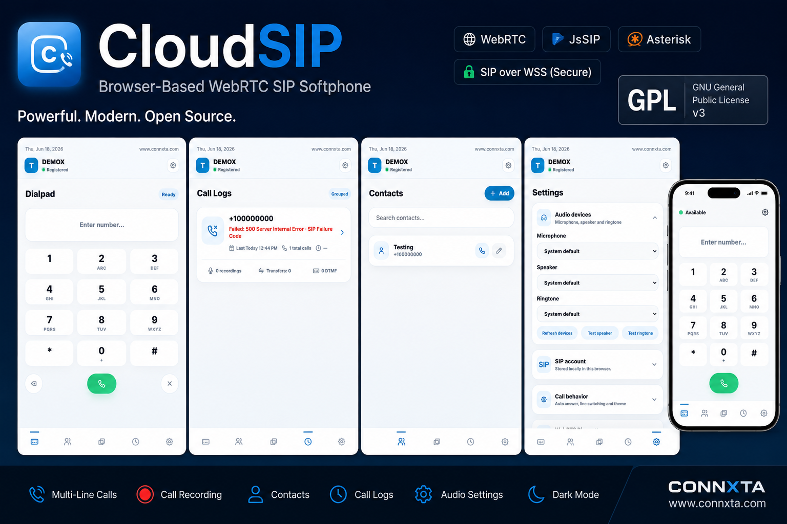

# CloudSIP



CloudSIP is a standalone browser-based WebRTC SIP softphone using JsSIP.

CloudSIP is designed for professional public deployment as a frontend-only static web application. Upload the files to an HTTPS-capable web server, open `index.html`, configure your SIP account, and place calls from a supported browser.

## Features

- SIP over WebSocket
- Multi-line calls
- Hold / mute / transfer / DTMF
- Local browser recording
- IndexedDB recording persistence
- Contacts
- Call logs and call threads
- Audio device settings
- Dark mode
- Keyboard shortcuts

## No npm / no build step

CloudSIP is a static browser application. No build process is required.

This project does not require npm, package managers, bundlers, transpilers, or build scripts. Keep the source readable and deployable as plain static files.

## Quick start

1. Clone or download this repository.
2. Upload the files to an HTTPS web server.
3. Open `index.html` in a supported browser.
4. Configure SIP credentials in Settings.

## Local testing

Use any simple static server. For example, with Python:

```sh
python3 -m http.server 8080
```

Then open `http://localhost:8080/var/www/html/index.html` if serving from the repository root, or run the server from `var/www/html` and open `http://localhost:8080/`.

## Browser requirements

- HTTPS or localhost is required for WebRTC microphone access.
- Chrome or Edge is recommended.
- Microphone permission is required.

## Asterisk / WebRTC note

CloudSIP requires a SIP server that supports SIP over secure WebSocket and WebRTC media. For Asterisk deployments, enable WebSocket transport, TLS, DTLS-SRTP, ICE, and a WebRTC-compatible endpoint configuration. See [`docs/ASTERISK-WEBRTC.md`](docs/ASTERISK-WEBRTC.md) for guidance.

## Security and storage

CloudSIP uses browser-local storage by default:

- SIP settings are stored locally in browser `localStorage`.
- Recordings are stored locally in browser IndexedDB.
- No backend is required by default.

Do not commit real SIP passwords or production credentials to the repository.

## License and attribution

License: GNU GPL v3

CloudSIP is licensed under the GNU General Public License v3.0.
If you distribute a modified version of CloudSIP, you must also make the corresponding source code available under GPL v3.
Repository license identifiers: GPL-3.0, GNU GPL v3, GPLv3.
See [`LICENSE`](LICENSE).

Attribution/domain: [www.connxta.com](https://www.connxta.com)

## Disclaimer

CloudSIP is not for emergency calling. Do not rely on this software for emergency services or life-safety communications.
